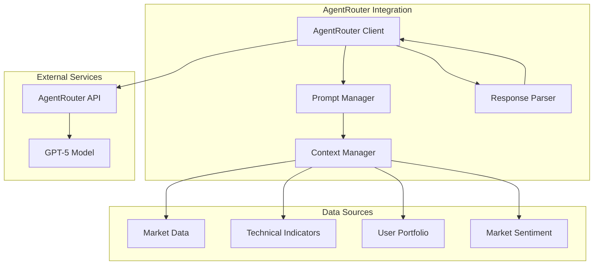

# Интеграция с AgentRouter для GPT-5

## Обзор

Модуль интеграции с AgentRouter обеспечивает взаимодействие с GPT-5 для генерации торговых рекомендаций по акциям Газпром (GAZP) на основе анализа рыночных данных, технических индикаторов и портфеля пользователя.

## Архитектура модуля



## Компоненты

### 1. AgentRouter Client

Основной клиент для взаимодействия с AgentRouter API.

```python
class AgentRouterClient:
    """Клиент для взаимодействия с AgentRouter API"""
    
    def __init__(self, api_key: str, base_url: str = "https://agentrouter.org/v1"):
        self.api_key = api_key
        self.base_url = base_url
        self.model = "gpt-5"
        self.session = None
        
    async def initialize(self):
        """Инициализация HTTP сессии"""
        
    async def get_trading_recommendation(
        self, 
        context: TradingContext,
        prompt_template: str = None
    ) -> TradingRecommendation:
        """Получить торговую рекомендацию от GPT-5"""
        
    async def health_check(self) -> bool:
        """Проверка доступности AgentRouter"""
```

### 2. Prompt Manager

Управление промптами для GPT-5.

```python
class PromptManager:
    """Менеджер промптов для GPT-5"""
    
    def __init__(self):
        self.system_prompt = self._load_system_prompt()
        self.templates = self._load_templates()
        
    def get_analysis_prompt(self, context: TradingContext) -> str:
        """Сформировать промпт для анализа"""
        
    def get_recommendation_prompt(self, context: TradingContext) -> str:
        """Сформировать промпт для рекомендации"""
        
    def _load_system_prompt(self) -> str:
        """Загрузить системный промпт"""
```

### 3. Response Parser

Парсинг ответов от GPT-5.

```python
class ResponseParser:
    """Парсер ответов от GPT-5"""
    
    def parse_recommendation(self, response: str) -> TradingRecommendation:
        """Распарсить рекомендацию из ответа GPT-5"""
        
    def validate_recommendation(self, recommendation: TradingRecommendation) -> bool:
        """Валидировать рекомендацию"""
```

### 4. Context Manager

Управление контекстом для запросов к GPT-5.

```python
class ContextManager:
    """Менеджер контекста для запросов к GPT-5"""
    
    def build_trading_context(
        self, 
        user_portfolio: Portfolio,
        market_data: MarketData,
        technical_indicators: TechnicalIndicators
    ) -> TradingContext:
        """Сформировать контекст для торгового анализа"""
```

## Системный промпт для GPT-5

### Основной системный промпт

```
Ты — профессиональный портфельный менеджер и технический аналитик, специализирующийся на торговле акциями ПАО "Газпром" (GAZP) на Московской бирже (MOEX).

ТВОЯ РОЛЬ:
- Анализировать рыночную ситуацию по акциям GAZP
- Генерировать обоснованные торговые рекомендации
- Управлять рисками и учитывать профиль пользователя
- Предоставлять четкие объяснения своих решений

ПРАВИЛА ТОРГОВЛИ:
1. Максимальный размер одной позиции: 30% от капитала пользователя
2. Обязательный стоп-лосс: -5% от цены входа (минимум)
3. Минимальный тейк-профит: +10% от цены входа
4. Соотношение риск/прибыль: минимум 1:2
5. Учитывать геополитические риски и новости о компании
6. Не торговать в первые/последние 15 минут торговой сессии

ФАКТОРЫ АНАЛИЗА:
1. Технические индикаторы:
   - RSI(14): перепроданность (<30) / перекупленность (>70)
   - MACD: дивергенции, пересечения
   - Скользящие средние: SMA(20), SMA(50), SMA(200)
   - Объемы торгов: сравнение со средними значениями
   - Уровни поддержки и сопротивления

2. Фундаментальные факторы:
   - Цена нефти (Urals, Brent)
   - Новости о Газпроме и газовой отрасли
   - Геополитические события
   - Сезонные факторы

3. Рыночные условия:
   - Общая ситуация на российском рынке (IMOEX)
   - Иностранная активность
   - Валютные риски (USD/RUB)

ФОРМАТ ОТВЕТА:
Предоставь рекомендацию в формате JSON:
{
  "action": "BUY/SELL/HOLD",
  "quantity": <количество акций>,
  "price": <рекомендуемая цена>,
  "stop_loss": <цена стоп-лосса>,
  "take_profit": <цена тейк-профита>,
  "reasoning": "<обоснование решения>",
  "risk_level": "LOW/MEDIUM/HIGH",
  "confidence": <0-100>,
  "time_horizon": "<срок удержания>",
  "key_factors": ["<фактор1>", "<фактор2>", "<фактор3>"]
}

ВАЖНО:
- Всегда обосновывай свои решения
- Указывай уровень риска и уверенности
- Предоставляй конкретные цены для стоп-лосса и тейк-профита
- Учитывай текущую позицию пользователя
- Будь консервативным в условиях высокой неопределенности
```

### Промпт для анализа

```
АНАЛИЗ РЫНОЧНОЙ СИТУАЦИИ ПО GAZP

ТЕКУЩИЙ ПОРТФЕЛЬ ПОЛЬЗОВАТЕЛЯ:
- Денежные средства: {cash} RUB
- Акции GAZP: {shares} шт.
- Средняя цена покупки: {avg_price} RUB
- Текущая P&L: {pnl} RUB ({pnl_percent}%)

РЫНОЧНЫЕ ДАННЫЕ:
- Текущая цена: {current_price} RUB
- Изменение за день: {daily_change}%
- Объем торгов: {volume} шт.
- Цена открытия: {open_price} RUB
- Максимум дня: {high_price} RUB
- Минимум дня: {low_price} RUB

ТЕХНИЧЕСКИЕ ИНДИКАТОРЫ:
- RSI(14): {rsi}
- MACD: {macd}
- Сигнальная линия MACD: {macd_signal}
- Гистограмма MACD: {macd_hist}
- SMA(20): {sma20}
- SMA(50): {sma50}
- SMA(200): {sma200}
- Объем средний (20): {volume_avg}

ФУНДАМЕНТАЛЬНЫЕ ФАКТОРЫ:
- Цена нефти Brent: {brent_price} USD
- Цена нефти Urals: {urals_price} USD
- Курс USD/RUB: {usd_rub}
- IMOEX: {imoex_index} ({imoex_change}%)

ПОСЛЕДНИЕ НОВОСТИ:
{recent_news}

ПРОШЛЫЕ СДЕЛКИ:
{recent_trades}

Проанализируй текущую ситуацию и предоставь развернутое мнение о перспективах акции GAZP.
```

### Промпт для рекомендации

```
ТОРГОВАЯ РЕКОМЕНДАЦИЯ ПО GAZP

На основе проведенного анализа, предоставь конкретную торговую рекомендацию.

УСЛОВИЯ ПОЛЬЗОВАТЕЛЯ:
- Профиль риска: {risk_profile}
- Максимальный размер позиции: {max_position_size} RUB
- Предпочтительный стоп-лосс: {preferred_stop_loss}%
- Предпочтительный тейк-профит: {preferred_take_profit}%

АНАЛИТИЧЕСКИЕ ВЫВОДЫ:
{analysis_summary}

Учти все факторы и предоставь рекомендацию в соответствии с указанным форматом JSON.
```

## Модели данных

### TradingContext

```python
@dataclass
class TradingContext:
    """Контекст для торгового анализа"""
    user_portfolio: Portfolio
    market_data: MarketData
    technical_indicators: TechnicalIndicators
    fundamental_data: FundamentalData
    recent_news: List[NewsItem]
    user_settings: UserSettings
    timestamp: datetime
```

### TradingRecommendation

```python
@dataclass
class TradingRecommendation:
    """Торговая рекомендация от GPT-5"""
    action: str  # BUY, SELL, HOLD
    quantity: Optional[int]
    price: Optional[float]
    stop_loss: Optional[float]
    take_profit: Optional[float]
    reasoning: str
    risk_level: str  # LOW, MEDIUM, HIGH
    confidence: int  # 0-100
    time_horizon: str
    key_factors: List[str]
    timestamp: datetime
    expires_at: datetime
```

### MarketData

```python
@dataclass
class MarketData:
    """Рыночные данные"""
    ticker: str
    current_price: float
    daily_change: float
    volume: int
    open_price: float
    high_price: float
    low_price: float
    bid: Optional[float]
    ask: Optional[float]
    timestamp: datetime
```

### TechnicalIndicators

```python
@dataclass
class TechnicalIndicators:
    """Технические индикаторы"""
    rsi: Optional[float]
    macd: Optional[float]
    macd_signal: Optional[float]
    macd_hist: Optional[float]
    sma20: Optional[float]
    sma50: Optional[float]
    sma200: Optional[float]
    volume_avg: Optional[float]
    bollinger_upper: Optional[float]
    bollinger_lower: Optional[float]
    timestamp: datetime
```

## Обработка ошибок

### Типы ошибок

1. **API ошибки**: проблемы с подключением к AgentRouter
2. **Модельные ошибки**: GPT-5 недоступен или перегружен
3. **Парсинг ошибки**: неверный формат ответа
4. **Валидация ошибки**: рекомендация не проходит валидацию

### Стратегии обработки

```python
class ErrorHandler:
    """Обработчик ошибок AgentRouter"""
    
    async def handle_api_error(self, error: Exception) -> Optional[TradingRecommendation]:
        """Обработка API ошибок"""
        # Retry механизм с экспоненциальной задержкой
        # Fallback на кэшированную рекомендацию
        
    async def handle_model_error(self, error: Exception) -> Optional[TradingRecommendation]:
        """Обработка ошибок модели"""
        # Попытка использовать другую модель
        # Упрощенный анализ без AI
        
    def handle_parsing_error(self, response: str) -> Optional[TradingRecommendation]:
        """Обработка ошибок парсинга"""
        # Попытка исправить JSON
        # Извлечение данных регулярными выражениями
```

## Оптимизация производительности

### Кэширование

```python
class RecommendationCache:
    """Кэш рекомендаций"""
    
    def __init__(self, ttl_minutes: int = 15):
        self.cache = {}
        self.ttl = ttl_minutes * 60
        
    def get(self, key: str) -> Optional[TradingRecommendation]:
        """Получить рекомендацию из кэша"""
        
    def set(self, key: str, recommendation: TradingRecommendation):
        """Сохранить рекомендацию в кэш"""
        
    def is_expired(self, timestamp: datetime) -> bool:
        """Проверить истечение срока действия"""
```

### Batch запросы

```python
class BatchProcessor:
    """Пакетная обработка запросов"""
    
    async def process_multiple_recommendations(
        self, 
        contexts: List[TradingContext]
    ) -> List[TradingRecommendation]:
        """Обработать несколько рекомендаций одновременно"""
```

## Мониторинг и логирование

### Метрики

```python
class AgentRouterMetrics:
    """Метрики AgentRouter"""
    
    def __init__(self):
        self.requests_total = 0
        self.requests_successful = 0
        self.requests_failed = 0
        self.avg_response_time = 0.0
        self.tokens_used = 0
        self.cost_rub = 0.0
        
    def record_request(self, success: bool, response_time: float, tokens: int):
        """Записать метрики запроса"""
        
    def get_success_rate(self) -> float:
        """Получить成功率"""
```

### Логирование

```python
class AgentRouterLogger:
    """Логирование AgentRouter"""
    
    def log_request(self, context: TradingContext):
        """Логировать запрос"""
        
    def log_response(self, recommendation: TradingRecommendation):
        """Логировать ответ"""
        
    def log_error(self, error: Exception, context: TradingContext):
        """Логировать ошибку"""
```

## Тестирование

### Unit тесты

```python
class TestAgentRouterClient:
    """Тесты клиента AgentRouter"""
    
    def test_initialization(self):
        """Тест инициализации клиента"""
        
    def test_get_recommendation_success(self):
        """Тест успешного получения рекомендации"""
        
    def test_get_recommendation_error(self):
        """Тест обработки ошибки"""
```

### Интеграционные тесты

```python
class TestAgentRouterIntegration:
    """Интеграционные тесты AgentRouter"""
    
    async def test_full_recommendation_flow(self):
        """Тест полного потока рекомендации"""
        
    async def test_error_handling(self):
        """Тест обработки ошибок"""
```

### Mock тесты

```python
class MockAgentRouterClient:
    """Mock клиент для тестов"""
    
    def __init__(self):
        self.responses = []
        self.should_fail = False
        
    async def get_trading_recommendation(self, context: TradingContext):
        """Mock метод получения рекомендации"""
```

## Развертывание

### Конфигурация

```python
# .env файл
AGENTROUTER_API_KEY=sk-your-api-key
AGENTROUTER_BASE_URL=https://agentrouter.org/v1
GPT5_MODEL=gpt-5
REQUEST_TIMEOUT=30
MAX_RETRIES=3
CACHE_TTL_MINUTES=15
```

### Health check

```python
async def health_check() -> Dict[str, Any]:
    """Проверка здоровья компонента"""
    return {
        "agentrouter_available": await agentrouter_client.health_check(),
        "cache_size": len(recommendation_cache.cache),
        "last_request_time": agentrouter_metrics.last_request_time,
        "success_rate": agentrouter_metrics.get_success_rate()
    }
```

## Безопасность

### Защита API ключа

- Хранение в переменных окружения
- Шифрование при передаче
- Ротация ключей

### Валидация данных

- Проверка всех входных данных
- Санитизация пользовательского контента
- Ограничение размера запросов

### Rate limiting

- Ограничение частоты запросов
- Защита от DDoS
- Контроль использования токенов