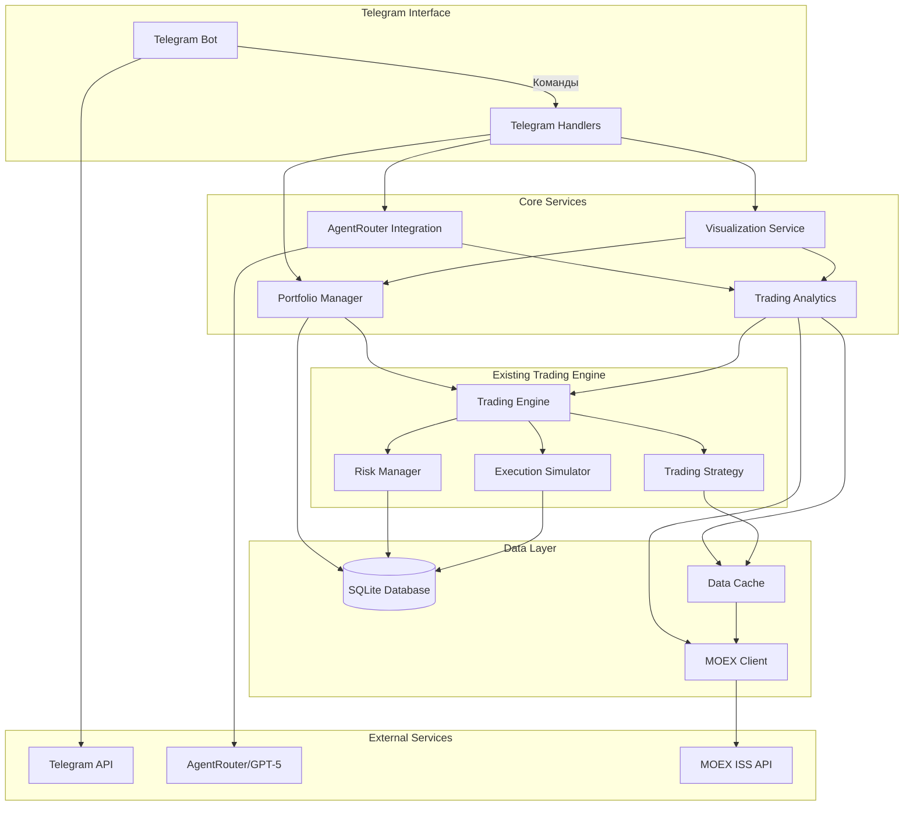
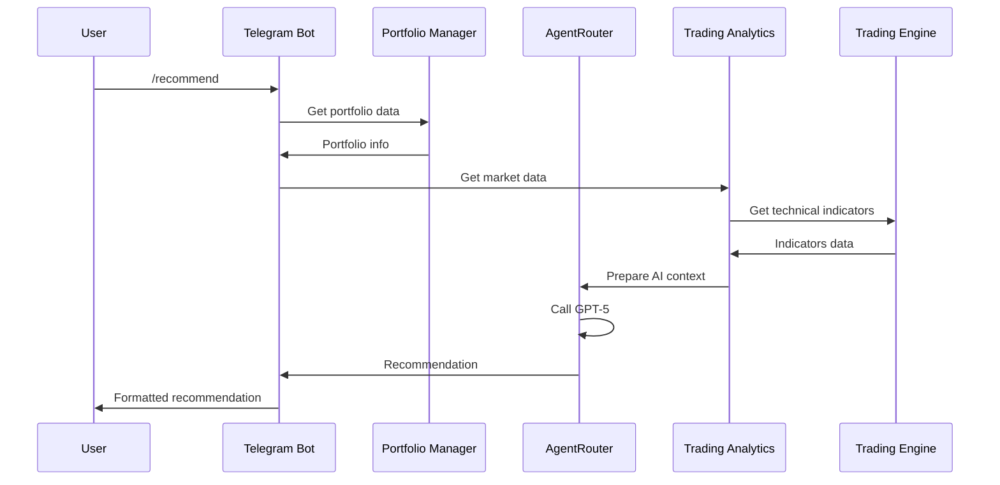
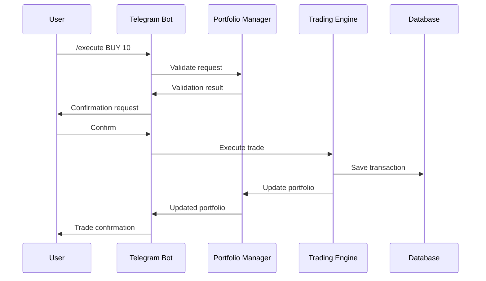

# Архитектура Telegram Trading Bot для GAZP с GPT-5

## Обзор архитектуры

Система построена на микросервисной архитектуре с четким разделением ответственности между компонентами. Основной принцип - рекомендательная система с подтверждением пользователя.



## Компоненты системы

### 1. Telegram Interface Layer

**Telegram Bot (`telegram_bot.py`)**
- Основной класс бота с интеграцией python-telegram-bot
- Обработка команд и обратных вызовов
- Управление сессиями пользователей

**Telegram Handlers (`telegram/handlers/`)**
- `start_handler.py` - инициализация пользователя и портфеля
- `portfolio_handler.py` - управление портфелем
- `recommend_handler.py` - получение рекомендаций от GPT-5
- `execute_handler.py` - исполнение сделок с подтверждением
- `history_handler.py` - история транзакций
- `performance_handler.py` - графики и отчеты
- `settings_handler.py` - настройки пользователя

### 2. Core Services

**Portfolio Manager (`portfolio/manager.py`)**
- Управление портфелями пользователей
- Расчет P&L и метрик
- Взаимодействие с базой данных

**AgentRouter Integration (`ai/agentrouter_client.py`)**
- Клиент для взаимодействия с AgentRouter API
- Управление промптами для GPT-5
- Обработка ответов и ошибок

**Trading Analytics (`analytics/analyzer.py`)**
- Сбор и обработка рыночных данных
- Расчет технических индикаторов
- Подготовка данных для AI-анализа

**Visualization Service (`visualization/charts.py`)**
- Генерация графиков цены и индикаторов
- Создание отчетов о производительности
- Сравнение с бенчмарками (IMOEX)

### 3. Data Layer

**SQLite Database (`database/models.py`)**
- Модели данных: User, Portfolio, Transaction, Recommendation
- ORM с использованием SQLAlchemy
- Миграции схемы

**MOEX Client (существующий `data/moex_client.py`)**
- Получение рыночных данных
- Исторические свечи и текущие котировки
- Информация об инструментах

**Data Cache (существующий `data/cache.py`)**
- Кэширование рыночных данных
- Уменьшение нагрузки на MOEX API
- Хранение технических индикаторов

### 4. Trading Engine Integration

**Trading Engine (существующий `core/trading_engine.py`)**
- Использование существующей логики
- Адаптация для рекомендательной системы
- Интеграция с портфельным менеджером

## Потоки данных

### 1. Поток рекомендации



### 2. Поток исполнения сделки



## Структура проекта

```
gazprom_bot/
├── telegram/
│   ├── __init__.py
│   ├── bot.py                 # Основной класс Telegram бота
│   └── handlers/
│       ├── __init__.py
│       ├── start_handler.py
│       ├── portfolio_handler.py
│       ├── recommend_handler.py
│       ├── execute_handler.py
│       ├── history_handler.py
│       ├── performance_handler.py
│       └── settings_handler.py
├── portfolio/
│   ├── __init__.py
│   ├── manager.py             # Управление портфелями
│   └── models.py              # Модели портфелей
├── ai/
│   ├── __init__.py
│   ├── agentrouter_client.py  # Интеграция с AgentRouter
│   └── prompts.py             # Промпты для GPT-5
├── analytics/
│   ├── __init__.py
│   └── analyzer.py            # Анализ рыночных данных
├── visualization/
│   ├── __init__.py
│   └── charts.py              # Генерация графиков
├── database/
│   ├── __init__.py
│   ├── models.py              # SQLAlchemy модели
│   ├── database.py            # Управление БД
│   └── migrations/            # Миграции схемы
├── main_telegram.py           # Запуск Telegram бота
└── main_trading.py            # Запуск торгового движка
```

## Интеграция с существующим кодом

### Переиспользуемые компоненты:
- `data/moex_client.py` - получение данных с MOEX
- `data/cache.py` - кэширование данных
- `core/trading_engine.py` - торговая логика
- `strategy/gazp_breakout.py` - стратегия анализа
- `indicators/technicals.py` - технические индикаторы
- `risk/manager.py` - управление рисками
- `execution/simulator.py` - симулятор исполнения

### Новые компоненты:
- Telegram интерфейс
- Интеграция с AgentRouter/GPT-5
- Управление портфелями пользователей
- Визуализация и отчеты
- База данных SQLite

## Безопасность и надежность

### Безопасность:
- Хранение API ключей в переменных окружения
- Валидация всех входных данных
- Ограничение прав доступа пользователей
- Шифрование чувствительных данных

### Надежность:
- Обработка ошибок AgentRouter с retry механизмом
- Graceful degradation при недоступности MOEX API
- Логирование всех критических операций
- Резервное копирование базы данных

## Масштабирование

### Горизонтальное масштабирование:
- Разделение Telegram бота и торгового движка
- Использование очередей сообщений (Redis/RabbitMQ)
- Микросервисная архитектура

### Вертикальное масштабирование:
- Оптимизация запросов к базе данных
- Кэширование рыночных данных
- Асинхронная обработка запросов