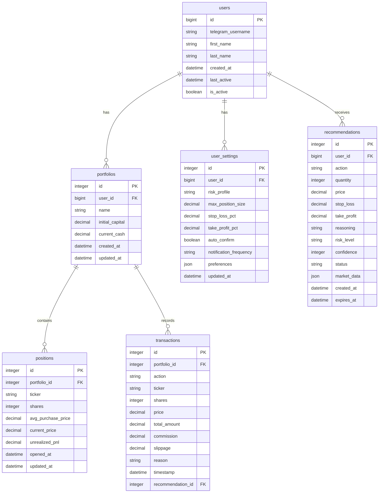

# Структура базы данных SQLite для Telegram Trading Bot

## Обзор

База данных использует SQLite с SQLAlchemy ORM для управления портфелями пользователей, транзакциями и AI рекомендациями.

## Схема базы данных



## Детальное описание таблиц

### 1. Таблица users

Хранит информацию о пользователях Telegram бота.

```sql
CREATE TABLE users (
    id BIGINT PRIMARY KEY,              -- Telegram user_id
    telegram_username VARCHAR(255),      -- @username в Telegram
    first_name VARCHAR(255),            -- Имя пользователя
    last_name VARCHAR(255),             -- Фамилия пользователя
    created_at TIMESTAMP DEFAULT CURRENT_TIMESTAMP,
    last_active TIMESTAMP DEFAULT CURRENT_TIMESTAMP,
    is_active BOOLEAN DEFAULT TRUE       -- Активен ли пользователь
);

-- Индексы
CREATE INDEX idx_users_telegram_username ON users(telegram_username);
CREATE INDEX idx_users_last_active ON users(last_active);
```

### 2. Таблица portfolios

Информация о портфелях пользователей.

```sql
CREATE TABLE portfolios (
    id INTEGER PRIMARY KEY AUTOINCREMENT,
    user_id BIGINT NOT NULL,           -- ID пользователя
    name VARCHAR(255) DEFAULT 'Основной', -- Название портфеля
    initial_capital DECIMAL(15,2) DEFAULT 100000.00, -- Начальный капитал
    current_cash DECIMAL(15,2) DEFAULT 100000.00,    -- Текущие наличные
    created_at TIMESTAMP DEFAULT CURRENT_TIMESTAMP,
    updated_at TIMESTAMP DEFAULT CURRENT_TIMESTAMP,
    
    FOREIGN KEY (user_id) REFERENCES users(id) ON DELETE CASCADE
);

-- Индексы
CREATE INDEX idx_portfolios_user_id ON portfolios(user_id);
CREATE UNIQUE INDEX idx_portfolios_user_name ON portfolios(user_id, name);
```

### 3. Таблица positions

Текущие открытые позиции в портфелях.

```sql
CREATE TABLE positions (
    id INTEGER PRIMARY KEY AUTOINCREMENT,
    portfolio_id INTEGER NOT NULL,      -- ID портфеля
    ticker VARCHAR(10) DEFAULT 'GAZP',  -- Тикер инструмента
    shares INTEGER DEFAULT 0,           -- Количество акций
    avg_purchase_price DECIMAL(10,2),   -- Средняя цена покупки
    current_price DECIMAL(10,2),         -- Текущая цена
    unrealized_pnl DECIMAL(15,2) DEFAULT 0.00, -- Нереализованный P&L
    opened_at TIMESTAMP DEFAULT CURRENT_TIMESTAMP,
    updated_at TIMESTAMP DEFAULT CURRENT_TIMESTAMP,
    
    FOREIGN KEY (portfolio_id) REFERENCES portfolios(id) ON DELETE CASCADE
);

-- Индексы
CREATE INDEX idx_positions_portfolio_id ON positions(portfolio_id);
CREATE INDEX idx_positions_ticker ON positions(ticker);
CREATE UNIQUE INDEX idx_positions_portfolio_ticker ON positions(portfolio_id, ticker);
```

### 4. Таблица transactions

История всех транзакций (покупок/продаж).

```sql
CREATE TABLE transactions (
    id INTEGER PRIMARY KEY AUTOINCREMENT,
    portfolio_id INTEGER NOT NULL,       -- ID портфеля
    action VARCHAR(4) NOT NULL,         -- BUY или SELL
    ticker VARCHAR(10) DEFAULT 'GAZP',  -- Тикер инструмента
    shares INTEGER NOT NULL,             -- Количество акций
    price DECIMAL(10,2) NOT NULL,       -- Цена за акцию
    total_amount DECIMAL(15,2) NOT NULL, -- Сумма сделки
    commission DECIMAL(10,2) DEFAULT 0.00, -- Комиссия
    slippage DECIMAL(10,2) DEFAULT 0.00,   -- Проскальзывание
    reason TEXT,                         -- Причина сделки
    timestamp TIMESTAMP DEFAULT CURRENT_TIMESTAMP,
    recommendation_id INTEGER,           -- ID AI рекомендации (если есть)
    
    FOREIGN KEY (portfolio_id) REFERENCES portfolios(id) ON DELETE CASCADE,
    FOREIGN KEY (recommendation_id) REFERENCES recommendations(id) ON DELETE SET NULL
);

-- Индексы
CREATE INDEX idx_transactions_portfolio_id ON transactions(portfolio_id);
CREATE INDEX idx_transactions_timestamp ON transactions(timestamp);
CREATE INDEX idx_transactions_ticker ON transactions(ticker);
CREATE INDEX idx_transactions_action ON transactions(action);
```

### 5. Таблица recommendations

AI рекомендации от GPT-5 через AgentRouter.

```sql
CREATE TABLE recommendations (
    id INTEGER PRIMARY KEY AUTOINCREMENT,
    user_id BIGINT NOT NULL,            -- ID пользователя
    action VARCHAR(4) NOT NULL,         -- BUY, SELL, HOLD
    quantity INTEGER,                    -- Рекомендуемое количество
    price DECIMAL(10,2),                -- Рекомендуемая цена
    stop_loss DECIMAL(10,2),            -- Уровень стоп-лосса
    take_profit DECIMAL(10,2),           -- Уровень тейк-профита
    reasoning TEXT,                      -- Обоснование решения
    risk_level VARCHAR(10),              -- LOW, MEDIUM, HIGH
    confidence INTEGER,                  -- Уверенность 0-100
    status VARCHAR(20) DEFAULT 'pending', -- pending, confirmed, rejected, expired
    market_data JSON,                    -- Рыночные данные на момент рекомендации
    created_at TIMESTAMP DEFAULT CURRENT_TIMESTAMP,
    expires_at TIMESTAMP,                -- Время истечения рекомендации
    
    FOREIGN KEY (user_id) REFERENCES users(id) ON DELETE CASCADE
);

-- Индексы
CREATE INDEX idx_recommendations_user_id ON recommendations(user_id);
CREATE INDEX idx_recommendations_status ON recommendations(status);
CREATE INDEX idx_recommendations_created_at ON recommendations(created_at);
CREATE INDEX idx_recommendations_expires_at ON recommendations(expires_at);
```

### 6. Таблица user_settings

Настройки пользователей бота.

```sql
CREATE TABLE user_settings (
    id INTEGER PRIMARY KEY AUTOINCREMENT,
    user_id BIGINT NOT NULL UNIQUE,     -- ID пользователя
    risk_profile VARCHAR(20) DEFAULT 'medium', -- conservative, moderate, aggressive
    max_position_size DECIMAL(15,2) DEFAULT 30000.00, -- Макс. размер позиции
    stop_loss_pct DECIMAL(5,4) DEFAULT 0.0080,     -- 0.8%
    take_profit_pct DECIMAL(5,4) DEFAULT 0.0150,   -- 1.5%
    auto_confirm BOOLEAN DEFAULT FALSE,   -- Автоподтверждение сделок
    notification_frequency VARCHAR(20) DEFAULT 'manual', -- manual, daily, weekly
    preferences JSON,                    -- Дополнительные настройки
    updated_at TIMESTAMP DEFAULT CURRENT_TIMESTAMP,
    
    FOREIGN KEY (user_id) REFERENCES users(id) ON DELETE CASCADE
);

-- Индексы
CREATE INDEX idx_user_settings_user_id ON user_settings(user_id);
```

## SQLAlchemy модели

### Модель User

```python
from sqlalchemy import Column, BigInteger, String, DateTime, Boolean
from sqlalchemy.ext.declarative import declarative_base

Base = declarative_base()

class User(Base):
    __tablename__ = 'users'
    
    id = Column(BigInteger, primary_key=True)  # Telegram user_id
    telegram_username = Column(String(255))
    first_name = Column(String(255))
    last_name = Column(String(255))
    created_at = Column(DateTime, default=datetime.utcnow)
    last_active = Column(DateTime, default=datetime.utcnow)
    is_active = Column(Boolean, default=True)
    
    # Отношения
    portfolios = relationship("Portfolio", back_populates="user")
    settings = relationship("UserSettings", back_populates="user", uselist=False)
    recommendations = relationship("Recommendation", back_populates="user")
```

### Модель Portfolio

```python
from sqlalchemy import Column, Integer, BigInteger, String, DECIMAL, DateTime, ForeignKey
from sqlalchemy.orm import relationship

class Portfolio(Base):
    __tablename__ = 'portfolios'
    
    id = Column(Integer, primary_key=True, autoincrement=True)
    user_id = Column(BigInteger, ForeignKey('users.id'), nullable=False)
    name = Column(String(255), default='Основной')
    initial_capital = Column(DECIMAL(15, 2), default=100000.00)
    current_cash = Column(DECIMAL(15, 2), default=100000.00)
    created_at = Column(DateTime, default=datetime.utcnow)
    updated_at = Column(DateTime, default=datetime.utcnow, onupdate=datetime.utcnow)
    
    # Отношения
    user = relationship("User", back_populates="portfolios")
    positions = relationship("Position", back_populates="portfolio")
    transactions = relationship("Transaction", back_populates="portfolio")
    
    @property
    def total_value(self):
        """Общая стоимость портфеля"""
        return self.current_cash + sum(pos.current_value for pos in self.positions)
    
    @property
    def total_pnl(self):
        """Общий P&L портфеля"""
        return self.total_value - self.initial_capital
```

### Модель Position

```python
class Position(Base):
    __tablename__ = 'positions'
    
    id = Column(Integer, primary_key=True, autoincrement=True)
    portfolio_id = Column(Integer, ForeignKey('portfolios.id'), nullable=False)
    ticker = Column(String(10), default='GAZP')
    shares = Column(Integer, default=0)
    avg_purchase_price = Column(DECIMAL(10, 2))
    current_price = Column(DECIMAL(10, 2))
    unrealized_pnl = Column(DECIMAL(15, 2), default=0.00)
    opened_at = Column(DateTime, default=datetime.utcnow)
    updated_at = Column(DateTime, default=datetime.utcnow, onupdate=datetime.utcnow)
    
    # Отношения
    portfolio = relationship("Portfolio", back_populates="positions")
    
    @property
    def current_value(self):
        """Текущая стоимость позиции"""
        return self.shares * (self.current_price or 0)
    
    @property
    def pnl_percent(self):
        """P&L в процентах"""
        if self.avg_purchase_price and self.avg_purchase_price > 0:
            return ((self.current_price or 0) - self.avg_purchase_price) / self.avg_purchase_price * 100
        return 0
```

### Модель Transaction

```python
class Transaction(Base):
    __tablename__ = 'transactions'
    
    id = Column(Integer, primary_key=True, autoincrement=True)
    portfolio_id = Column(Integer, ForeignKey('portfolios.id'), nullable=False)
    action = Column(String(4), nullable=False)  # BUY или SELL
    ticker = Column(String(10), default='GAZP')
    shares = Column(Integer, nullable=False)
    price = Column(DECIMAL(10, 2), nullable=False)
    total_amount = Column(DECIMAL(15, 2), nullable=False)
    commission = Column(DECIMAL(10, 2), default=0.00)
    slippage = Column(DECIMAL(10, 2), default=0.00)
    reason = Column(String(500))
    timestamp = Column(DateTime, default=datetime.utcnow)
    recommendation_id = Column(Integer, ForeignKey('recommendations.id'))
    
    # Отношения
    portfolio = relationship("Portfolio", back_populates="transactions")
    recommendation = relationship("Recommendation")
```

### Модель Recommendation

```python
class Recommendation(Base):
    __tablename__ = 'recommendations'
    
    id = Column(Integer, primary_key=True, autoincrement=True)
    user_id = Column(BigInteger, ForeignKey('users.id'), nullable=False)
    action = Column(String(4), nullable=False)  # BUY, SELL, HOLD
    quantity = Column(Integer)
    price = Column(DECIMAL(10, 2))
    stop_loss = Column(DECIMAL(10, 2))
    take_profit = Column(DECIMAL(10, 2))
    reasoning = Column(String(2000))
    risk_level = Column(String(10))  # LOW, MEDIUM, HIGH
    confidence = Column(Integer)  # 0-100
    status = Column(String(20), default='pending')  # pending, confirmed, rejected, expired
    market_data = Column(JSON)  # Рыночные данные в JSON
    created_at = Column(DateTime, default=datetime.utcnow)
    expires_at = Column(DateTime)
    
    # Отношения
    user = relationship("User", back_populates="recommendations")
    transactions = relationship("Transaction", back_populates="recommendation")
```

### Модель UserSettings

```python
class UserSettings(Base):
    __tablename__ = 'user_settings'
    
    id = Column(Integer, primary_key=True, autoincrement=True)
    user_id = Column(BigInteger, ForeignKey('users.id'), nullable=False, unique=True)
    risk_profile = Column(String(20), default='medium')
    max_position_size = Column(DECIMAL(15, 2), default=30000.00)
    stop_loss_pct = Column(DECIMAL(5, 4), default=0.0080)  # 0.8%
    take_profit_pct = Column(DECIMAL(5, 4), default=0.0150)  # 1.5%
    auto_confirm = Column(Boolean, default=False)
    notification_frequency = Column(String(20), default='manual')
    preferences = Column(JSON)
    updated_at = Column(DateTime, default=datetime.utcnow, onupdate=datetime.utcnow)
    
    # Отношения
    user = relationship("User", back_populates="settings")
```

## Миграции базы данных

### Версия 1.0.0 - Initial schema

```sql
-- Создание всех таблиц выше
-- Добавление индексов
-- Добавление внешних ключей
```

### Версия 1.1.0 - Добавление аналитики

```sql
-- Добавление таблицы analytics_events для отслеживания действий
CREATE TABLE analytics_events (
    id INTEGER PRIMARY KEY AUTOINCREMENT,
    user_id BIGINT,
    event_type VARCHAR(50),
    event_data JSON,
    timestamp TIMESTAMP DEFAULT CURRENT_TIMESTAMP
);

-- Добавление таблицы performance_metrics для метрик производительности
CREATE TABLE performance_metrics (
    id INTEGER PRIMARY KEY AUTOINCREMENT,
    portfolio_id INTEGER,
    date DATE,
    total_return DECIMAL(10, 4),
    benchmark_return DECIMAL(10, 4),
    alpha DECIMAL(10, 4),
    volatility DECIMAL(10, 4),
    sharpe_ratio DECIMAL(10, 4),
    max_drawdown DECIMAL(10, 4),
    created_at TIMESTAMP DEFAULT CURRENT_TIMESTAMP
);
```

## Оптимизации производительности

### Индексы

- Композитные индексы для частых запросов
- Индексы на временные поля для аналитики
- Уникальные индексы для предотвращения дубликатов

### Запросы

- Использование prepared statements
- Пагинация для больших объемов данных
- Кэширование частых запросов в памяти

### Размер базы данных

- Регулярная очистка старых рекомендаций
- Архивирование старых транзакций
- Оптимизация VACUUM для SQLite

## Безопасность

### Защита данных

- Параметризованные запросы для предотвращения SQL-injection
- Валидация входных данных
- Ограничение прав доступа к базе данных

### Резервное копирование

- Ежедневные бэкапы базы данных
- Хранение бэкапов в разных локациях
- Тестирование восстановления из бэкапов