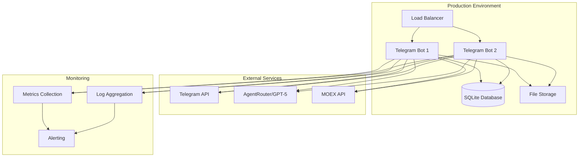

# Руководство по развертыванию Telegram Trading Bot для GAZP

## Обзор

Это руководство описывает процесс развертывания Telegram Trading Bot для торговли акциями Газпрома с использованием GPT-5 через AgentRouter. Система построена на рекомендательной модели с подтверждением пользователя.

## Системные требования

### Минимальные требования
- **CPU**: 2 ядра
- **RAM**: 4 ГБ
- **Storage**: 20 ГБ SSD
- **OS**: Ubuntu 20.04+ / CentOS 8+ / macOS 10.15+
- **Python**: 3.11+
- **Network**: Стабильное интернет-соединение

### Рекомендуемые требования
- **CPU**: 4 ядра
- **RAM**: 8 ГБ
- **Storage**: 50 ГБ SSD
- **OS**: Ubuntu 22.04 LTS
- **Python**: 3.11+
- **Network**: Высокоскоростное соединение

## Архитектура развертывания



## Установка и настройка

### 1. Клонирование репозитория

```bash
# Клонирование репозитория
git clone https://github.com/nsn99/gazprom_bot.git
cd gazprom-trading-bot

# Создание виртуального окружения
python3 -m venv venv
source venv/bin/activate  # Linux/macOS
# или venv\Scripts\activate  # Windows
```

### 2. Установка зависимостей

```bash
# Установка зависимостей
pip install -r requirements.txt

# Установка дополнительных зависимостей для визуализации
pip install matplotlib plotly seaborn

# Установка зависимостей для базы данных
pip install sqlalchemy alembic

# Установка зависимостей для Telegram бота
pip install python-telegram-bot aiohttp

# Установка зависимостей для AgentRouter
pip install openai httpx pandas numpy
```

### 3. Конфигурация переменных окружения

Создайте файл `.env` в корне проекта:

```bash
# Telegram Bot Configuration
TELEGRAM_BOT_TOKEN=your_telegram_bot_token
WEBHOOK_URL=https://your-domain.com/webhook
WEBHOOK_PORT=8443

# AgentRouter Configuration
AGENTROUTER_API_KEY=sk-your-agentrouter-api-key
AGENTROUTER_BASE_URL=https://agentrouter.org/v1
GPT5_MODEL=gpt-5

# Database Configuration
DATABASE_URL=sqlite:///data/gazprom_bot.db
DATABASE_BACKUP_PATH=/backup/gazprom_bot/

# MOEX API Configuration
MOEX_BASE_URL=https://iss.moex.com/iss
MOEX_RATE_LIMIT=1.0  # requests per second
MOEX_TIMEOUT=10.0  # seconds

# Trading Configuration
DEFAULT_INITIAL_CAPITAL=100000.0
MAX_POSITION_SIZE_PCT=0.3
DEFAULT_STOP_LOSS_PCT=0.008
DEFAULT_TAKE_PROFIT_PCT=0.015

# Risk Management
MAX_TRADES_PER_DAY=5
DAILY_LOSS_LIMIT_RUB=1000.0
MIN_RISK_REWARD_RATIO=1.5

# Logging Configuration
LOG_LEVEL=INFO
LOG_FILE_PATH=/var/log/gazprom_bot/bot.log
LOG_MAX_SIZE=10MB
LOG_BACKUP_COUNT=5

# Monitoring Configuration
METRICS_PORT=9090
HEALTH_CHECK_PORT=8080
PROMETHEUS_GATEWAY_URL=http://prometheus:9090

# Security Configuration
SECRET_KEY=your-secret-key-for-encryption
JWT_EXPIRATION_HOURS=24
RATE_LIMIT_REQUESTS=100
RATE_LIMIT_WINDOW=3600

# Performance Configuration
CACHE_TTL_MINUTES=15
MAX_CONCURRENT_REQUESTS=10
REQUEST_TIMEOUT_SECONDS=30
```

### 4. Настройка базы данных

```bash
# Создание директории для базы данных
mkdir -p data
mkdir -p backup

# Инициализация базы данных
python -m alembic upgrade head

# Создание административного пользователя (опционально)
python scripts/create_admin.py
```

### 5. Настройка SSL сертификатов (для webhook)

```bash
# Генерация самоподписанного сертификата (для тестирования)
openssl req -newkey rsa:2048 -nodes -keyout private.key -x509 -days 365 -out public.pem

# Или использование Let's Encrypt (для production)
sudo apt install certbot
sudo certbot certonly --standalone -d your-domain.com
```

## Запуск системы

### 1. Запуск в режиме разработки

```bash
# Запуск Telegram бота в режиме polling
python main_telegram.py

# Запуск с отладочными логами
LOG_LEVEL=DEBUG python main_telegram.py

# Запуск с использованием webhook
python main_telegram.py --webhook --port 8443 --cert public.pem --key private.key
```

### 2. Запуск в режиме production

#### Использование systemd

Создайте файл `/etc/systemd/system/gazprom-bot.service`:

```ini
[Unit]
Description=GAZP Trading Bot
After=network.target

[Service]
Type=simple
User=botuser
WorkingDirectory=/opt/gazprom-trading-bot
Environment=PATH=/opt/gazprom-trading-bot/venv/bin
ExecStart=/opt/gazprom-trading-bot/venv/bin/python main_telegram.py
Restart=always
RestartSec=10

[Install]
WantedBy=multi-user.target
```

Запуск и управление сервисом:

```bash
# Перезагрузить systemd
sudo systemctl daemon-reload

# Запустить сервис
sudo systemctl start gazprom-bot

# Включить автозапуск
sudo systemctl enable gazprom-bot

# Проверить статус
sudo systemctl status gazprom-bot

# Просмотреть логи
sudo journalctl -u gazprom-bot -f
```

#### Использование Docker

Создайте `Dockerfile`:

```dockerfile
FROM python:3.11-slim

WORKDIR /app

# Установка системных зависимостей
RUN apt-get update && apt-get install -y \
    gcc \
    g++ \
    && rm -rf /var/lib/apt/lists/*

# Копирование зависимостей
COPY requirements.txt .
RUN pip install --no-cache-dir -r requirements.txt

# Копирование приложения
COPY . .

# Создание директорий
RUN mkdir -p data logs backup

# Настройка прав доступа
RUN useradd -m -u 1000 botuser && chown -R botuser:botuser /app
USER botuser

# Открытие портов
EXPOSE 8443 8080 9090

# Запуск приложения
CMD ["python", "main_telegram.py"]
```

Создайте `docker-compose.yml`:

```yaml
version: '3.8'

services:
  gazprom-bot:
    build: .
    ports:
      - "8443:8443"
      - "8080:8080"
      - "9090:9090"
    volumes:
      - ./data:/app/data
      - ./logs:/app/logs
      - ./backup:/app/backup
    environment:
      - TELEGRAM_BOT_TOKEN=${TELEGRAM_BOT_TOKEN}
      - AGENTROUTER_API_KEY=${AGENTROUTER_API_KEY}
      - DATABASE_URL=sqlite:///data/gazprom_bot.db
      - LOG_LEVEL=INFO
    restart: unless-stopped
    healthcheck:
      test: ["CMD", "curl", "-f", "http://localhost:8080/health"]
      interval: 30s
      timeout: 10s
      retries: 3
      start_period: 40s

  nginx:
    image: nginx:alpine
    ports:
      - "80:80"
      - "443:443"
    volumes:
      - ./nginx.conf:/etc/nginx/nginx.conf
      - ./ssl:/etc/nginx/ssl
    depends_on:
      - gazprom-bot
    restart: unless-stopped

  prometheus:
    image: prom/prometheus:latest
    ports:
      - "9091:9090"
    volumes:
      - ./prometheus.yml:/etc/prometheus/prometheus.yml
      - ./prometheus_data:/prometheus
    command:
      - '--config.file=/etc/prometheus/prometheus.yml'
      - '--storage.tsdb.path=/prometheus'
      - '--web.console.libraries=/etc/prometheus/console_libraries'
      - '--web.console.templates=/etc/prometheus/consoles'
    restart: unless-stopped
```

Запуск с Docker Compose:

```bash
# Сборка и запуск
docker-compose up -d

# Просмотр логов
docker-compose logs -f gazprom-bot

# Остановка
docker-compose down
```

## Мониторинг и логирование

### 1. Настройка Prometheus

Создайте `prometheus.yml`:

```yaml
global:
  scrape_interval: 15s
  evaluation_interval: 15s

rule_files:
  - "alert_rules.yml"

scrape_configs:
  - job_name: 'gazprom-bot'
    static_configs:
      - targets: ['localhost:9090']
    metrics_path: '/metrics'
    scrape_interval: 5s

alerting:
  alertmanagers:
    - static_configs:
        - targets:
          - alertmanager:9093
```

### 2. Настройка Grafana

Импортируйте дашборды для мониторинга:
- Производительность бота
- Метрики рекомендаций
- Статистика сделок
- Использование API

### 3. Настройка логирования

Конфигурация логирования в `logging.yaml`:

```yaml
version: 1
disable_existing_loggers: false

formatters:
  standard:
    format: '%(asctime)s [%(levelname)s] %(name)s: %(message)s'
  json:
    format: '{"timestamp": "%(asctime)s", "level": "%(levelname)s", "logger": "%(name)s", "message": "%(message)s"}'

handlers:
  console:
    class: logging.StreamHandler
    level: INFO
    formatter: standard
    stream: ext://sys.stdout

  file:
    class: logging.handlers.RotatingFileHandler
    level: INFO
    formatter: json
    filename: /var/log/gazprom_bot/bot.log
    maxBytes: 10485760  # 10MB
    backupCount: 5

  sentry:
    class: sentry_sdk.integrations.logging.SentryHandler
    level: ERROR

loggers:
  gazprom_bot:
    level: INFO
    handlers: [console, file, sentry]
    propagate: false

root:
  level: INFO
  handlers: [console, file]
```

## Безопасность

### 1. Настройка файрвола

```bash
# Открытие необходимых портов
sudo ufw allow 22/tcp    # SSH
sudo ufw allow 80/tcp    # HTTP
sudo ufw allow 443/tcp   # HTTPS
sudo ufw allow 8443/tcp  # Webhook
sudo ufw enable
```

### 2. Настройка SSL/TLS

```bash
# Установка Certbot
sudo apt install certbot python3-certbot-nginx

# Получение сертификата
sudo certbot --nginx -d your-domain.com

# Автоматическое обновление
sudo crontab -e
# Добавить строку:
# 0 12 * * * /usr/bin/certbot renew --quiet
```

### 3. Настройка безопасности приложения

```python
# config/security.py
import os
from cryptography.fernet import Fernet

class SecurityConfig:
    SECRET_KEY = os.getenv('SECRET_KEY')
    ENCRYPTION_KEY = Fernet.generate_key()
    
    # Rate limiting
    RATE_LIMIT_REQUESTS = int(os.getenv('RATE_LIMIT_REQUESTS', 100))
    RATE_LIMIT_WINDOW = int(os.getenv('RATE_LIMIT_WINDOW', 3600))
    
    # JWT настройки
    JWT_EXPIRATION_HOURS = int(os.getenv('JWT_EXPIRATION_HOURS', 24))
    JWT_ALGORITHM = 'HS256'
    
    # CORS настройки
    CORS_ORIGINS = ['https://your-domain.com']
    CORS_METHODS = ['GET', 'POST']
```

## Резервное копирование и восстановление

### 1. Настройка резервного копирования

Создайте скрипт `scripts/backup.sh`:

```bash
#!/bin/bash

BACKUP_DIR="/backup/gazprom_bot"
DATE=$(date +%Y%m%d_%H%M%S)
DB_FILE="data/gazprom_bot.db"

# Создание директории
mkdir -p $BACKUP_DIR

# Резервное копирование базы данных
sqlite3 $DB_FILE ".backup $BACKUP_DIR/gazprom_bot_$DATE.db"

# Архивирование
tar -czf $BACKUP_DIR/gazprom_bot_backup_$DATE.tar.gz \
    $BACKUP_DIR/gazprom_bot_$DATE.db \
    data/ \
    logs/

# Удаление старых бэкапов (оставляем последние 7 дней)
find $BACKUP_DIR -name "*.tar.gz" -mtime +7 -delete

echo "Backup completed: gazprom_bot_backup_$DATE.tar.gz"
```

Настройте cron для автоматического бэкапа:

```bash
# Редактирование crontab
sudo crontab -e

# Добавить строку для ежедневного бэкапа в 2:00
0 2 * * * /opt/gazprom-trading-bot/scripts/backup.sh
```

### 2. Восстановление из бэкапа

Создайте скрипт `scripts/restore.sh`:

```bash
#!/bin/bash

BACKUP_FILE=$1
RESTORE_DIR="/tmp/gazprom_restore"

if [ -z "$BACKUP_FILE" ]; then
    echo "Usage: $0 <backup_file.tar.gz>"
    exit 1
fi

# Создание временной директории
mkdir -p $RESTORE_DIR

# Распаковка архива
tar -xzf $BACKUP_FILE -C $RESTORE_DIR

# Остановка бота
sudo systemctl stop gazprom-bot

# Восстановление базы данных
cp $RESTORE_DIR/data/gazprom_bot.db data/

# Восстановление логов (опционально)
cp -r $RESTORE_DIR/logs/* logs/

# Запуск бота
sudo systemctl start gazprom-bot

# Очистка
rm -rf $RESTORE_DIR

echo "Restore completed from: $BACKUP_FILE"
```

## Тестирование развертывания

### 1. Unit тесты

```bash
# Запуск всех тестов
python -m pytest tests/

# Запуск с покрытием
python -m pytest tests/ --cov=gazprom_bot --cov-report=html

# Запуск конкретных тестов
python -m pytest tests/test_telegram_bot.py -v
```

### 2. Интеграционные тесты

```bash
# Запуск интеграционных тестов
python -m pytest tests/integration/ -v

# Тестирование с тестовой базой данных
TEST_DATABASE_URL=sqlite:///test.db python -m pytest tests/integration/
```

### 3. Нагрузочное тестирование

```bash
# Установка инструментов
pip install locust

# Запуск нагрузочного теста
locust -f tests/load_test.py --host=http://localhost:8080
```

## Обслуживание и обновление

### 1. Процесс обновления

```bash
#!/bin/bash
# scripts/update.sh

# Создание бэкапа
./scripts/backup.sh

# Остановка бота
sudo systemctl stop gazprom-bot

# Обновление кода
git pull origin main

# Обновление зависимостей
source venv/bin/activate
pip install -r requirements.txt

# Миграция базы данных
python -m alembic upgrade head

# Запуск бота
sudo systemctl start gazprom-bot

echo "Update completed"
```

### 2. Мониторинг здоровья

Создайте скрипт `scripts/health_check.sh`:

```bash
#!/bin/bash

# Проверка здоровья бота
HEALTH_URL="http://localhost:8080/health"
RESPONSE=$(curl -s -o /dev/null -w "%{http_code}" $HEALTH_URL)

if [ $RESPONSE -eq 200 ]; then
    echo "Bot is healthy"
    exit 0
else
    echo "Bot is unhealthy (HTTP $RESPONSE)"
    # Отправка алерта
    curl -X POST "https://api.telegram.org/bot$TELEGRAM_BOT_TOKEN/sendMessage" \
         -d "chat_id=$ADMIN_CHAT_ID&text=🚨 Bot health check failed"
    exit 1
fi
```

### 3. Очистка ресурсов

Создайте скрипт `scripts/cleanup.sh`:

```bash
#!/bin/bash

# Очистка старых логов
find logs/ -name "*.log" -mtime +30 -delete

# Очистка старых бэкапов
find backup/ -name "*.tar.gz" -mtime +7 -delete

# Очистка кэша
find data/cache/ -name "*" -mtime +1 -delete

# Оптимизация базы данных
sqlite3 data/gazprom_bot.db "VACUUM;"

echo "Cleanup completed"
```

## Поиск и устранение проблем

### 1. Общие проблемы

#### Проблема: Бот не запускается
```bash
# Проверка логов
sudo journalctl -u gazprom-bot -n 50

# Проверка конфигурации
python -c "import gazprom_bot.config; print('Config OK')"

# Проверка зависимостей
pip list | grep -E "(telegram|openai|sqlalchemy)"
```

#### Проблема: Нет подключения к AgentRouter
```bash
# Проверка API ключа
curl -H "Authorization: Bearer $AGENTROUTER_API_KEY" \
     https://agentrouter.org/v1/models

# Проверка сетевого соединения
ping agentrouter.org
```

#### Проблема: База данных заблокирована
```bash
# Проверка процессов
lsof data/gazprom_bot.db

# Перезапуск бота
sudo systemctl restart gazprom-bot
```

### 2. Мониторинг производительности

```bash
# Проверка использования ресурсов
top -p $(pgrep -f "python.*main_telegram")

# Проверка памяти
free -h

# Проверка дискового пространства
df -h
```

### 3. Логирование отладочной информации

```python
# Включение debug логирования
import logging
logging.getLogger('gazprom_bot').setLevel(logging.DEBUG)

# Логирование запросов к API
import httpx
httpx.logging.add_httpx_logging()
```

## Масштабирование

### 1. Горизонтальное масштабирование

```yaml
# docker-compose.scale.yml
version: '3.8'

services:
  gazprom-bot:
    build: .
    deploy:
      replicas: 3
    environment:
      - INSTANCE_ID={{.Task.Slot}}
```

### 2. Вертикальное масштабирование

```bash
# Увеличение ресурсов контейнера
docker-compose up -d --scale gazprom-bot=3

# Настройка ресурсов в docker-compose.yml
deploy:
  resources:
    limits:
      cpus: '2.0'
      memory: 4G
    reservations:
      cpus: '1.0'
      memory: 2G
```

## Заключение

Это руководство охватывает все аспекты развертывания Telegram Trading Bot для GAZP, от базовой установки до production-развертывания с мониторингом и масштабированием.

При следовании этим инструкциям вы получите надежную, масштабируемую и безопасную систему для торговли акциями Газпрома с использованием AI GPT-5.

Для дополнительной информации обратитесь к:
- [ARCHITECTURE.md](ARCHITECTURE.md) - архитектура системы
- [DATABASE_SCHEMA.md](DATABASE_SCHEMA.md) - схема базы данных
- [AGENTROUTER_INTEGRATION.md](AGENTROUTER_INTEGRATION.md) - интеграция с AI
- [TELEGRAM_INTERFACE.md](TELEGRAM_INTERFACE.md) - интерфейс бота
- [GPT5_PROMPTS.md](GPT5_PROMPTS.md) - система промптов