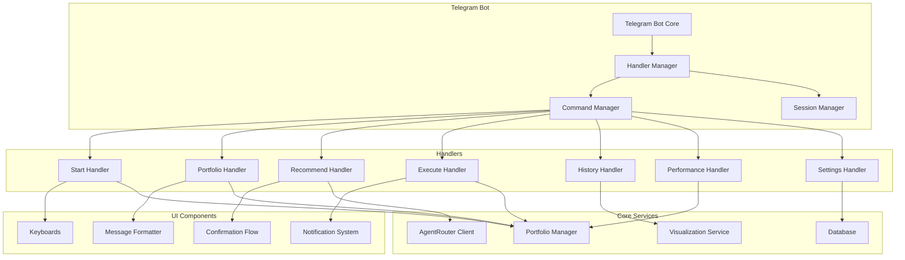
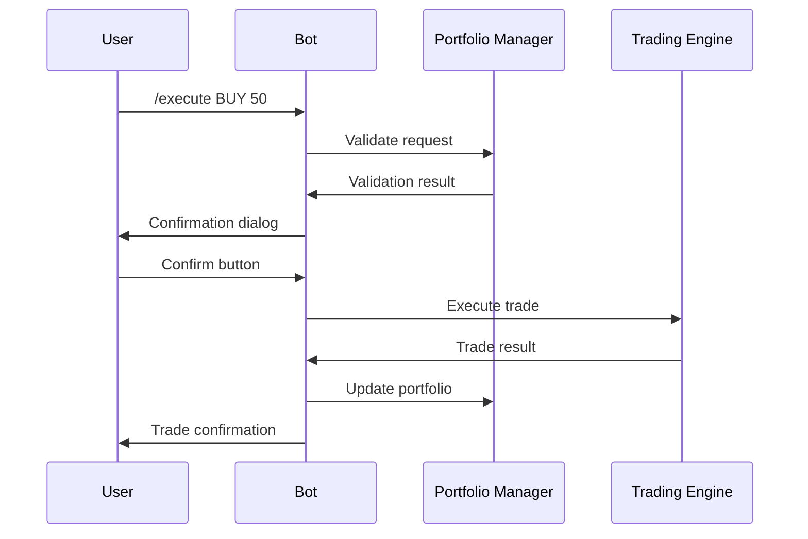
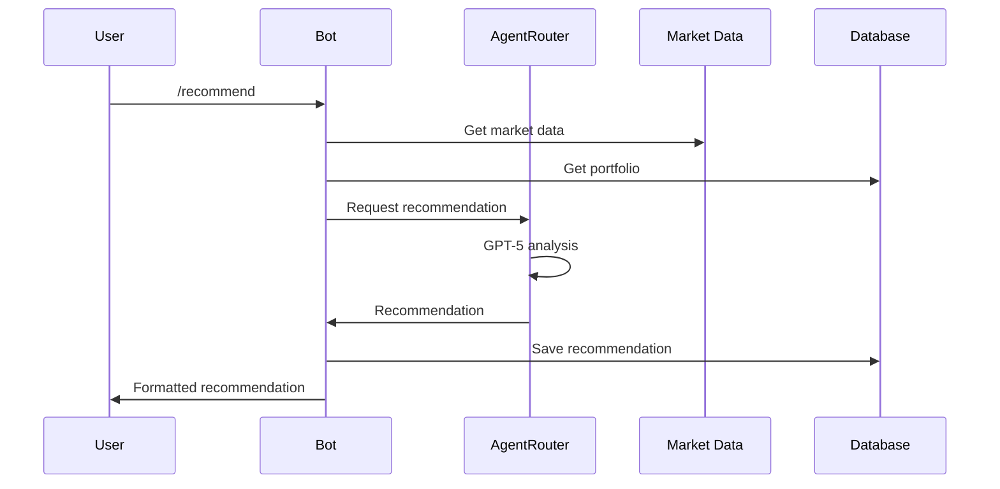

# Telegram Bot Interface для GAZP Trading Bot

## Обзор

Telegram бот предоставляет пользовательский интерфейс для взаимодействия с торговой системой на основе GPT-5. Бот работает в режиме рекомендательной системы с подтверждением пользователя.

## Архитектура интерфейса



## Команды бота

### Основные команды

#### `/start` - Инициализация бота
```python
async def start_handler(update: Update, context: ContextTypes.DEFAULT_TYPE):
    """
    Обработчик команды /start.
    Создает пользователя, портфель по умолчанию и приветствует.
    """
```

**Функционал:**
- Регистрация нового пользователя
- Создание портфеля по умолчанию (100,000 RUB)
- Отправка приветственного сообщения
- Отображение главного меню

**Пример ответа:**
```
🚀 Добро пожаловать в GAZP Trading Bot!

Я ваш персональный помощник для торговли акциями Газпрома с использованием AI GPT-5.

📊 Ваш портфель:
- Начальный капитал: 100,000 RUB
- Текущие средства: 100,000 RUB
- Позиций: нет

🎯 Доступные команды:
/recommend - Получить AI-рекомендацию
/portfolio - Посмотреть портфель
/help - Помощь

Начнем работу? Выберите действие:
```

#### `/portfolio` - Управление портфелем
```python
async def portfolio_handler(update: Update, context: ContextTypes.DEFAULT_TYPE):
    """
    Обработчик команды /portfolio.
    Показывает текущее состояние портфеля.
    """
```

**Функционал:**
- Отображение текущего портфеля
- P&L по позициям
- История сделок
- График доходности

**Пример ответа:**
```
📊 Ваш портфель (Основной)

💰 Баланс:
- Наличные: 85,500 RUB
- Инвестиции: 14,500 RUB
- Общая стоимость: 100,000 RUB

📈 Позиции:
GAZP: 100 шт. @ 145.00 RUB
- Текущая цена: 145.50 RUB
- P&L: +50 RUB (+0.34%)

📊 Доходность:
- За сегодня: +0.34%
- За неделю: +2.1%
- За месяц: +5.3%
- С начала: 0.00%

🔄 Действия:
[Обновить] [История] [График]
```

#### `/recommend` - Получить рекомендацию
```python
async def recommend_handler(update: Update, context: ContextTypes.DEFAULT_TYPE):
    """
    Обработчик команды /recommend.
    Запрашивает рекомендацию у GPT-5.
    """
```

**Функционал:**
- Сбор рыночных данных
- Анализ через GPT-5
- Форматирование рекомендации
- Предложение действий

**Пример ответа:**
```
🤖 AI-рекомендация от GPT-5

📊 Анализ рынка GAZP:
- Текущая цена: 145.50 RUB (+0.3% за день)
- RSI(14): 42.5 (нейтрально)
- MACD: бычье пересечение
- Объем: выше среднего на 15%

🎯 Рекомендация:
ДЕЙСТВИЕ: BUY
КОЛИЧЕСТВО: 50 акций
ЦЕНА: ~145.50 RUB

🛡️ Риск-менеджмент:
STOP-LOSS: 138.23 RUB (-5%)
TAKE-PROFIT: 160.05 RUB (+10%)

💡 Обоснование:
Технический анализ показывает бычий сигнал:
- MACD пересекает сигнальную линию вверх
- Объемы выше средних значений
- Цена пробивает уровень сопротивления 145.00

⚠️ Уровень риска: MEDIUM
Уверенность: 75%

🔄 Действия:
[Купить] [Подробнее] [Отклонить]
```

#### `/execute` - Исполнение сделки
```python
async def execute_handler(update: Update, context: ContextTypes.DEFAULT_TYPE):
    """
    Обработчик команды /execute.
    Исполняет сделку с подтверждением.
    """
```

**Формат:** `/execute [BUY/SELL] [количество] [цена]`

**Функционал:**
- Валидация параметров
- Расчет стоимости сделки
- Запрос подтверждения
- Исполнение через симулятор

**Пример диалога:**
```
Пользователь: /execute BUY 50

Бот: 🔄 Подтверждение сделки

📊 Детали сделки:
- Действие: BUY
- Инструмент: GAZP
- Количество: 50 акций
- Цена: ~145.50 RUB
- Стоимость: 7,275 RUB
- Комиссия: 2.18 RUB (0.03%)
- Итого: 7,277.18 RUB

💰 Ваш баланс после сделки:
- Наличные: 78,222.82 RUB
- GAZP: 150 акций @ 145.23 RUB

⚠️ Риски:
- Максимальный убыток: -361 RUB (-5%)
- Потенциальная прибыль: +723 RUB (+10%)

Подтверждаете сделку?

[✅ Да, исполнить] [❌ Отмена]
```

#### `/history` - История транзакций
```python
async def history_handler(update: Update, context: ContextTypes.DEFAULT_TYPE):
    """
    Обработчик команды /history.
    Показывает историю сделок.
    """
```

**Функционал:**
- Список последних сделок
- Фильтрация по периоду
- P&L по каждой сделке
- Экспорт в CSV

**Пример ответа:**
```
📜 История сделок

🔍 Последние 10 сделок:

1. 2025-10-25 14:30 | BUY | 100 GAZP @ 144.00 RUB
   P&L: +150 RUB (+1.04%)
   Причина: AI-рекомендация #42

2. 2025-10-24 11:15 | SELL | 50 GAZP @ 142.50 RUB
   P&L: -75 RUB (-0.52%)
   Причина: Stop-loss

3. 2025-10-23 10:00 | BUY | 50 GAZP @ 143.00 RUB
   P&L: -25 RUB (-0.17%)
   Причина: AI-рекомендация #41

📊 Статистика:
- Всего сделок: 15
- Успешных: 9 (60%)
- Общий P&L: +450 RUB (+0.45%)

🔄 Действия:
[Все сделки] [Экспорт CSV] [Фильтр]
```

#### `/performance` - Графики и отчеты
```python
async def performance_handler(update: Update, context: ContextTypes.DEFAULT_TYPE):
    """
    Обработчик команды /performance.
    Генерирует графики и отчеты.
    """
```

**Функционал:**
- График цены GAZP
- График доходности портфеля
- Сравнение с IMOEX
- Технические индикаторы

**Пример ответа:**
```
📈 Анализ производительности

📊 График цены GAZP (30 дней):
[график цены]

📈 График доходности портфеля:
[график доходности]

🏆 Сравнение с рынком:
- Ваш портфель: +5.3%
- IMOEX индекс: +3.8%
- Alpha: +1.5%

📊 Технические индикаторы:
- RSI(14): 42.5
- MACD: бычий сигнал
- SMA(20): 144.80
- SMA(50): 143.20

🔄 Действия:
[Детальный анализ] [Экспорт PDF] [Настройки]
```

#### `/settings` - Настройки
```python
async def settings_handler(update: Update, context: ContextTypes.DEFAULT_TYPE):
    """
    Обработчик команды /settings.
    Управляет настройками пользователя.
    """
```

**Функционал:**
- Профиль риска
- Размер позиции
- Уведомления
- Автоподтверждение

**Пример ответа:**
```
⚙️ Настройки

🎯 Профиль риска: MEDIUM
- Макс. позиция: 30,000 RUB
- Stop-loss: 5%
- Take-profit: 10%

🔔 Уведомления:
- Рекомендации: Вкл
- Сделки: Вкл
- Ежедневные отчеты: Выкл

⚡ Автоматизация:
- Автоподтверждение: Выкл
- Автоматический стоп-лосс: Вкл

🔄 Действия:
[Изменить риск] [Уведомления] [Автоматизация]
```

### Расширенные команды

#### `/setinitial [сумма]` - Установить начальный капитал
```
/setinitial 200000
```

#### `/setrisk [уровень]` - Установить профиль риска
```
/setrisk conservative
/setrisk moderate
/setrisk aggressive
```

#### `/subscribe [частота]` - Настройка уведомлений
```
/subscribe daily
/subscribe weekly
/subscribe off
```

#### `/export` - Экспорт данных
```
/export csv
/export pdf
/export json
```

## Пользовательские интерфейсы

### Клавиатуры (Inline Keyboards)

#### Главное меню
```python
main_menu_keyboard = InlineKeyboardMarkup([
    [
        InlineKeyboardButton("📊 Портфель", callback_data="portfolio"),
        InlineKeyboardButton("🤖 Рекомендация", callback_data="recommend")
    ],
    [
        InlineKeyboardButton("📈 Графики", callback_data="performance"),
        InlineKeyboardButton("📜 История", callback_data="history")
    ],
    [
        InlineKeyboardButton("⚙️ Настройки", callback_data="settings"),
        InlineKeyboardButton("❓ Помощь", callback_data="help")
    ]
])
```

#### Клавиатура подтверждения сделки
```python
confirm_trade_keyboard = InlineKeyboardMarkup([
    [
        InlineKeyboardButton("✅ Да, исполнить", callback_data="confirm_yes"),
        InlineKeyboardButton("❌ Отмена", callback_data="confirm_no")
    ]
])
```

#### Клавиатура рекомендации
```python
recommendation_keyboard = InlineKeyboardMarkup([
    [
        InlineKeyboardButton("🔄 Купить", callback_data="execute_buy"),
        InlineKeyboardButton("📊 Подробнее", callback_data="recommend_details")
    ],
    [
        InlineKeyboardButton("❌ Отклонить", callback_data="recommend_reject")
    ]
])
```

### Форматирование сообщений

#### Формат портфеля
```python
def format_portfolio_message(portfolio: Portfolio) -> str:
    """Форматирует сообщение о портфеле"""
    
    total_value = portfolio.total_value
    total_pnl = portfolio.total_pnl
    pnl_percent = (total_pnl / portfolio.initial_capital) * 100
    
    message = f"""
📊 Ваш портфель ({portfolio.name})

💰 Баланс:
- Наличные: {portfolio.current_cash:,.2f} RUB
- Инвестиции: {total_value - portfolio.current_cash:,.2f} RUB
- Общая стоимость: {total_value:,.2f} RUB

📈 Доходность:
- P&L: {total_pnl:+,.2f} RUB ({pnl_percent:+.2f}%)
"""
    
    if portfolio.positions:
        message += "\n📊 Позиции:\n"
        for pos in portfolio.positions:
            pnl_percent = pos.pnl_percent
            message += f"{pos.ticker}: {pos.shares} шт. @ {pos.avg_purchase_price:.2f} RUB\n"
            message += f"  P&L: {pos.unrealized_pnl:+,.2f} RUB ({pnl_percent:+.2f}%)\n"
    
    return message
```

#### Формат рекомендации
```python
def format_recommendation_message(recommendation: TradingRecommendation) -> str:
    """Форматирует сообщение с рекомендацией"""
    
    risk_emoji = {"LOW": "🟢", "MEDIUM": "🟡", "HIGH": "🔴"}
    confidence_emoji = "⭐" * (recommendation.confidence // 20)
    
    message = f"""
🤖 AI-рекомендация от GPT-5

🎯 Рекомендация:
ДЕЙСТВИЕ: {recommendation.action}
КОЛИЧЕСТВО: {recommendation.quantity} акций
ЦЕНА: {recommendation.price:.2f} RUB

🛡️ Риск-менеджмент:
STOP-LOSS: {recommendation.stop_loss:.2f} RUB
TAKE-PROFIT: {recommendation.take_profit:.2f} RUB

💡 Обоснование:
{recommendation.reasoning}

⚠️ Уровень риска: {risk_emoji.get(recommendation.risk_level, '⚪')} {recommendation.risk_level}
Уверенность: {recommendation.confidence}% {confidence_emoji}
"""
    
    return message
```

## Flow управления сессиями

### Управление состоянием пользователя

```python
class UserSession:
    """Сессия пользователя"""
    
    def __init__(self, user_id: int):
        self.user_id = user_id
        self.state = "main_menu"
        self.data = {}
        self.last_activity = datetime.now()
        
    def set_state(self, state: str, data: dict = None):
        """Установить состояние"""
        self.state = state
        if data:
            self.data.update(data)
        self.last_activity = datetime.now()
```

### Flow подтверждения сделки



### Flow получения рекомендации



## Обработка ошибок

### Типы ошибок

1. **Ошибки валидации**: неверные параметры команды
2. **Ошибки API**: проблемы с MOEX или AgentRouter
3. **Ошибки исполнения**: недостаточно средств, рынок закрыт
4. **Системные ошибки**: проблемы с базой данных

### Обработка ошибок

```python
class ErrorHandler:
    """Обработчик ошибок бота"""
    
    async def handle_validation_error(self, update: Update, error: ValidationError):
        """Обработка ошибок валидации"""
        await update.message.reply_text(
            f"❌ Ошибка валидации: {error.message}\n"
            f"💡 Пример: /execute BUY 50"
        )
    
    async def handle_api_error(self, update: Update, error: APIError):
        """Обработка API ошибок"""
        await update.message.reply_text(
            f"🔌 Проблема с подключением: {error.message}\n"
            f"🔄 Попробуйте позже"
        )
    
    async def handle_execution_error(self, update: Update, error: ExecutionError):
        """Обработка ошибок исполнения"""
        await update.message.reply_text(
            f"⚠️ Ошибка исполнения: {error.message}\n"
            f"💰 Проверьте баланс и лимиты"
        )
```

## Локализация

### Поддерживаемые языки
- Русский (основной)
- Английский (дополнительный)

### Формат сообщений

```python
class Localizer:
    """Локализатор сообщений"""
    
    def __init__(self, language: str = "ru"):
        self.language = language
        self.messages = self._load_messages()
    
    def get_message(self, key: str, **kwargs) -> str:
        """Получить локализованное сообщение"""
        template = self.messages.get(key, key)
        return template.format(**kwargs)
```

## Тестирование

### Unit тесты

```python
class TestTelegramHandlers:
    """Тесты обработчиков Telegram"""
    
    async def test_start_handler(self):
        """Тест обработчика /start"""
        
    async def test_portfolio_handler(self):
        """Тест обработчика /portfolio"""
        
    async def test_recommend_handler(self):
        """Тест обработчика /recommend"""
```

### Интеграционные тесты

```python
class TestTelegramIntegration:
    """Интеграционные тесты Telegram"""
    
    async def test_full_recommendation_flow(self):
        """Тест полного потока рекомендации"""
        
    async def test_trade_execution_flow(self):
        """Тест потока исполнения сделки"""
```

## Развертывание

### Конфигурация

```python
# config.py
TELEGRAM_BOT_TOKEN = "your-bot-token"
WEBHOOK_URL = "https://your-domain.com/webhook"
WEBHOOK_PORT = 8443
SSL_CERT_PATH = "/path/to/cert.pem"
SSL_KEY_PATH = "/path/to/key.pem"
```

### Запуск бота

```python
async def main():
    """Запуск Telegram бота"""
    
    application = ApplicationBuilder().token(TELEGRAM_BOT_TOKEN).build()
    
    # Добавление обработчиков
    application.add_handler(CommandHandler("start", start_handler))
    application.add_handler(CommandHandler("portfolio", portfolio_handler))
    # ... другие обработчики
    
    # Запуск
    await application.run_polling()
```

### Webhook настройка

```python
async def setup_webhook(application):
    """Настройка webhook"""
    await application.bot.set_webhook(
        url=WEBHOOK_URL,
        certificate=open(SSL_CERT_PATH, 'rb')
    )
```

## Безопасность

### Защита бота

1. **Валидация входных данных**
2. **Rate limiting** для пользователей
3. **Проверка прав доступа**
4. **Логирование действий**

### Защита данных

1. **Шифрование** чувствительных данных
2. **Анонимизация** логов
3. **Резервное копирование** данных
4. **Контроль доступа** к базе данных